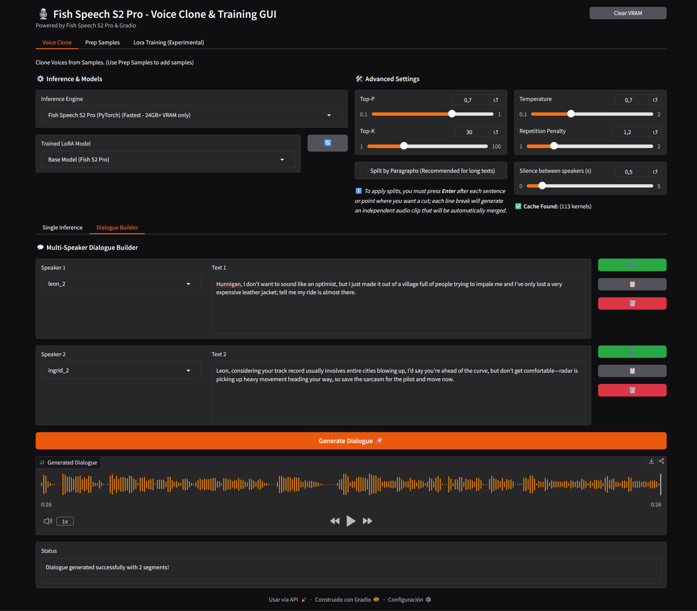

# 🎙️ Fish Speech S2 Pro - Voice Clone & Training GUI

A comprehensive, all-in-one Graphical User Interface (GUI) for **Fish Speech S2 Pro**. This project streamlines the process of voice cloning, dataset preparation, and LoRA training, providing a robust and optimized experience on Windows with full GPU acceleration.


### 2026-04-24 - Add Dialogue Builder - Multi Speaker Support Inference
We've introduced a **Dialogue Builder** sub-tab within the Voice Clone interface, designed for creating multi-speaker interactions easily:

*   **Dynamic Row Management**: Effortlessly build dialogues by adding (`➕`), cloning (`📋`), or removing (`🗑️`) speaker segments. 
*   **Multi-Speaker Support**: Assign a different voice sample and custom text to every segment in the conversation.
*   **Sequential Synthesis**: Generates each segment independently using the shared global settings (Engine, Model, Temperature, etc.) and automatically concatenates them.
*   **Customizable Silences**: Control the natural flow of the conversation with a dedicated slider to adjust the duration of silence (0 to 5 seconds) between each speaker.
*   **Internal Audio Mastering**: Every output is automatically volume normalized before rendering, ensuring professional consistency across all segments.



### 🚀 2026-03-29 - Windows Performance Breakthrough
We have successfully achieved **Linux-level inference speeds on Windows** through several major architectural optimizations:
*   **Ninja + MSVC Integration**: Transitioned to the **Ninja build system** and **Visual Studio 2022** with high-performance compiler flags (`/Ox`, `/arch:AVX2`, `/LTCG`) for an ultra-optimized C++ and Pytroch inference engines.
*   **OpenMP Parallelization**: The CPU-bound audio codec (DAC) is now fully multithreaded, leveraging all available cores for rapid audio generation.
*   **Hybrid Core Affinity**: Intelligent thread management tailored for **Intel 12th/13th/14th Gen (P-cores/E-cores)** and **AMD Ryzen**, pinning compute-heavy tasks to the fastest physical cores.
*   **Persistent Torch Cache & Triton (Pytorch Engine)**: Integration of `triton-windows` and a custom kernel caching system in `models/.cache`, enabling the full power of `torch.compile` (`max-autotune`) with near-instant startups.

## Key Features

### 🔊 High-Performance Voice Cloning
*   **Dual-Engine Support**: Choose between **C++ (s2.cpp) Backend** (optimized for GGUF models) or **PyTorch Backend**.
*   **GGUF Quantization Support**: Native support for **F16, Q8_0, Q6_K, Q5_K_M, Q4_K_M, Q3_K, and Q2_K** models.
*   **Automated GPU Orchestration**: 
    *   **CUDA Core Engine**: Used for high-precision models (F16, Q8_0) on supported NVIDIA GPUs.
    *   **Vulkan Engine**: Leveraged for K-quantized models (`Q_K` types) to ensure stability and compatibility.
    *   **CPU Fallback**: Automatic fallback for lower quantization levels or systems without dedicated GPUs.
*   **Intelligent Text Processing**: Features automatic paragraph splitting for long texts to ensure smooth and high-quality synthesis.

### 🛠️ Advanced Dataset Preparation
*   **Single Editor**: Drag-and-drop interface for individual audio editing. Trim, normalize, and transcribe audio on the fly.
*   **Batch Processor**: Automatically process entire folders of audio. 
    *   Normalizes volume and converts to mono.
    *   Uses **Faster-Whisper** for rapid, accurate batched transcriptions (creates `.lab` files).
    *   Generates `metadata.csv` required for training automatically.

### 🏋️ LoRA Training Pipeline (Experimental)
> [!IMPORTANT]
> **LoRA Fine-Tuning is Experimental:** *Fish Speech S2 PRO* is a highly-tuned foundation model. LoRA training might not show significant improvements for small or standard datasets. However, it can make a noticeable difference when:
> - Working with **extremely large datasets**.
> - Teaching the model a **new language**, unique **accent**, or specific **dialect**.
> - Fine-tuning for **style-specific** speech patterns.
> 
> ⚠️ **Hardware Requirement:** Training is computationally intensive and exclusive to GPUs with **more than 24 GB of VRAM**.

*   **Unified Workflow**: A simplified, 4-step pipeline that handles dataset preparation, VQ code extraction, sharding, and actual LoRA training.
*   **VRAM Optimization**: Hardware presets for **24GB** and **32GB+ VRAM** to auto-tune batch sizes and gradient accumulation.
*   **Auto-Tune Max Steps**: Automatically calculates the optimal number of training steps based on your dataset size.
*   **One-Click Export**: Automatically exports trained LoRA weights for immediate use in the inference tab.

### 🌟 One click install
*   **Automated Infrastructure**: The installer automatically detects and installs missing dependencies like **Visual Studio 2022 C++ Tools, CUDA Toolkit, and Vulkan SDK** via `winget`.
*   **GPU Architecture aware**: Auto-detects GPU architecture and installs the appropriate version of CUDA. Ampere (RTX 30 series), Ada (RTX 40 series) & Blackwell (RTX 50 series) Support. 


## 🚀 Quick Start (Windows)

### 0. Clone the repository

```bash
git clone https://github.com/Mixomo/Fish_audio_S2_Simple_GUI.git

cd Fish_audio_S2_Simple_GUI
```

### 1. Installation
Simply run the batch installer:
```cmd
install.bat
```
The script will set up a virtual environment through uv and install all necessary Python libraries, CUDA - PyTorch specific version for your GPU architecture, and compile s2.cpp for CUDA, Vulkan & CPU.

### 2. Launch
Start the application:
```cmd
start.bat
```
Inspired by [FranckyB](https://github.com/FranckyB) [Voice Clone Studio](https://github.com/FranckyB/Voice-Clone-Studio)

Based on [Fish Speech S2 PRO](https://huggingface.co/fishaudio/s2-pro) by [Fish Audio](https://github.com/fishaudio)
