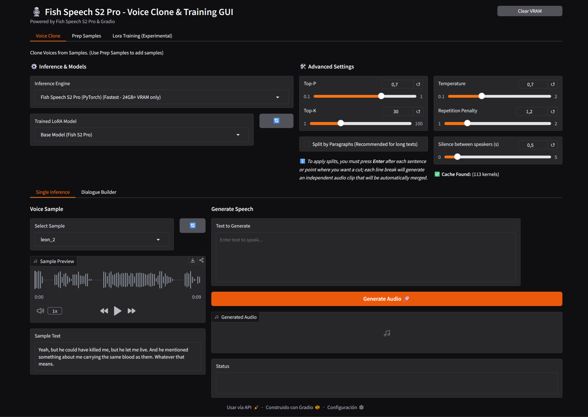
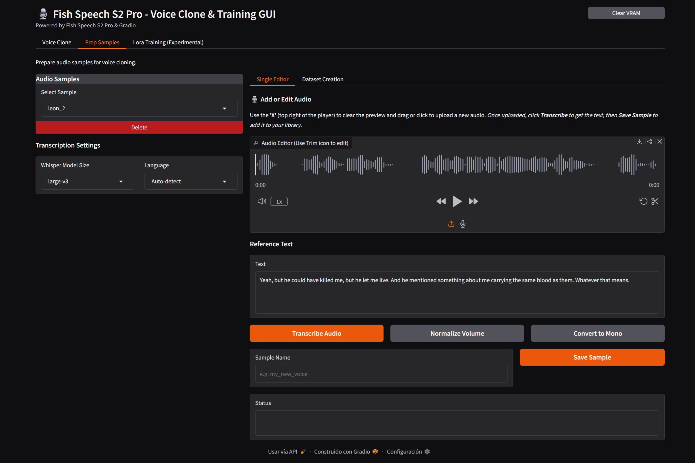
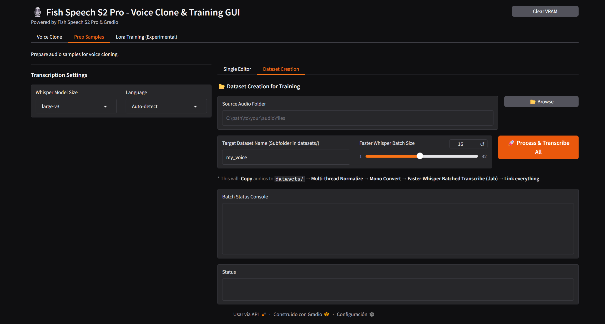
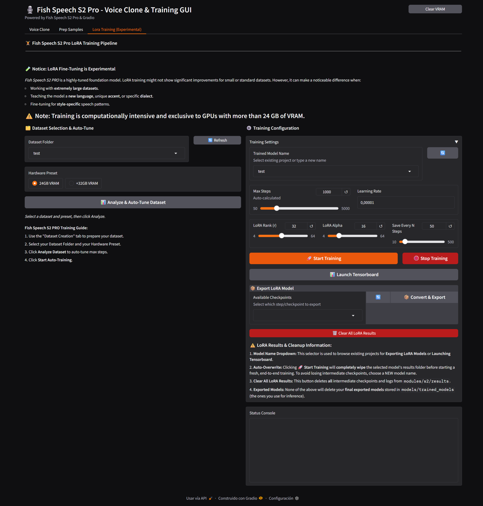

# 🎙️ Fish Speech S2 Pro - Voice Clone & Training GUI

A comprehensive, all-in-one Graphical User Interface (GUI) for **Fish Speech S2 Pro**. This project streamlines the process of voice cloning, dataset preparation, and LoRA training, providing a robust and optimized experience on **Linux / WSL** with full GPU acceleration.









### 🚀 2026-03-29 - Power Optimizations (Linux/WSL)
The project now features high-performance improvements for Linux/WSL platforms:
*   **Ninja + GCC/Clang Build Optimization**: Faster and more efficient C++ builds using the **Ninja** build system and **GCC/Clang** with high-performance flags (`-O3`, `-march=native`, `-ffast-math`).
*   **OpenMP Multithreaded Engine**: The audio codec (DAC) is now fully multithreaded using **OpenMP**, utilizing all available CPU cores for audio generation.
*   **Advanced Thread Affinity**: Intelligent CPU thread management using `OMP_PROC_BIND` and `OMP_PLACES`, tailored for **Intel Hybrid 12th/13th/14th Gen (P-cores/E-cores)** and **AMD Ryzen**.
*   **Persistent Torch Cache**: Implementation of `TORCHINDUCTOR_CACHE_DIR` and `TRITON_CACHE_DIR` to cache optimized kernels in `models/.cache`, bringing near-instant inference startups to Linux.

## Key Features

### 🔊 High-Performance Voice Cloning
*   **Dual-Engine Support**: Choose between **C++ (s2.cpp) Backend** (optimized for GGUF models) or **PyTorch Backend**.
*   **GGUF Quantization Support**: Native support for **F16, Q8_0, Q6_K, Q5_K_M, Q4_K_M, Q3_K, and Q2_K** models. **Note: Under WSL, Vulkan is not supported, so only CUDA and CPU are available.**
*   **Automated GPU Orchestration**: 
    *   **CUDA Core Engine**: Used for high-precision models (F16, Q8_0) on supported NVIDIA GPUs.
    *   **Vulkan Engine**: Leveraged for K-quantized models (`Q_K` types) on native Linux to ensure stability and compatibility.
    *   **CPU Fallback**: Automatic fallback for lower quantization levels or systems without dedicated GPUs.
*   **Intelligent Text Processing**: Features automatic paragraph splitting for long texts to ensure smooth and high-quality synthesis.

### 🛠️ Advanced Dataset Preparation
*   **Single Editor**: Drag-and-drop interface for individual audio editing. Trim, normalize, and transcribe audio on the fly.
*   **Batch Processor**: Automatically process entire folders of audio. 
    *   Normalizes volume and converts to mono.
    *   Uses **Faster-Whisper** for rapid, accurate batched transcriptions (creates `.lab` files).
    *   Generates `metadata.csv` required for training automatically.

### 🏋️ LoRA Training Pipeline (Experimental)
> [!IMPORTANT]
> **LoRA Fine-Tuning is Experimental:** *Fish Speech S2 PRO* is a highly-tuned foundation model. LoRA training might not show significant improvements for small or standard datasets. However, it can make a noticeable difference when:
> - Working with **extremely large datasets**.
> - Teaching the model a **new language**, unique **accent**, or specific **dialect**.
> - Fine-tuning for **style-specific** speech patterns.
> 
> ⚠️ **Hardware Requirement:** Training is computationally intensive and exclusive to GPUs with **more than 24 GB of VRAM**.

*   **Unified Workflow**: A simplified, 4-step pipeline that handles dataset preparation, VQ code extraction, sharding, and actual LoRA training.
*   **VRAM Optimization**: Hardware presets for **24GB** and **32GB+ VRAM** to auto-tune batch sizes and gradient accumulation.
*   **Auto-Tune Max Steps**: Automatically calculates the optimal number of training steps based on your dataset size.
*   **One-Click Export**: Automatically exports trained LoRA weights for immediate use in the inference tab.

### 🌟 One-Click Install
*   **Automated Infrastructure**: The installer automatically detects and installs all Linux-compatible packages and dependencies.
*   **GPU Architecture Aware**: Auto-detects GPU architecture and installs the appropriate version of CUDA/PyTorch. Supports Ampere (RTX 30), Ada (RTX 40), and Blackwell (RTX 50).

## 🚀 Quick Start (Linux / WSL)

### 0. Clone the repository

```bash
git clone -b main_linux https://github.com/Mixomo/Fish_audio_S2_Simple_GUI.git

cd Fish_audio_S2_Simple_GUI
```

### 1. Installation

First, navigate to the project directory and give execution permissions to the scripts:

```bash
chmod +x install.sh start.sh
```

Then, run the installer:

```bash
./install.sh
```

The script will set up a virtual environment via `uv`, install all necessary Python libraries (including the specific CUDA-Torch version for your GPU), and compile `s2.cpp`.

### 2. Launch

Start the application:

```bash
./start.sh
```

---
Inspired by [FranckyB](https://github.com/FranckyB)'s [Voice Clone Studio](https://github.com/FranckyB/Voice-Clone-Studio)

Based on [Fish Speech S2 PRO](https://huggingface.co/fishaudio/s2-pro) by [Fish Audio](https://github.com/fishaudio)
